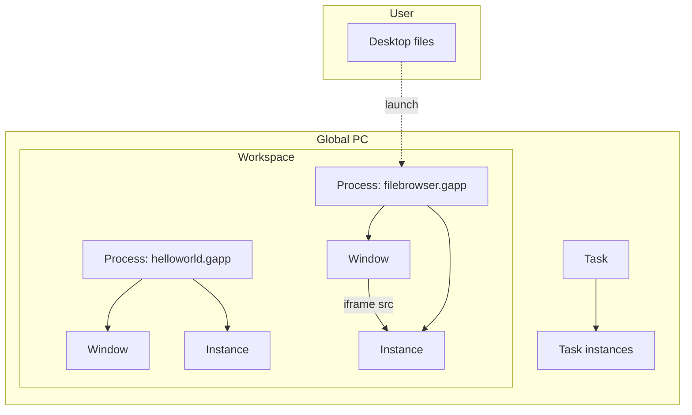

# GlobalOS architecture

Canonical model for how the web desktop is structured: ownership, lifetimes, and naming.

## Glossary

| Term | Meaning |
|------|---------|
| **Auth session** | Better Auth login cookie / `session` table row. Unrelated to the desktop desk. |
| **Global PC** | The user’s machine: shared services, icon prefs, and the pool of workspaces. |
| **Workspace** | A persistent desk slot on a Global PC. Groups **processes** (and thus windows). What users Open / Delete in “My Workspaces”. |
| **Visit** | One spell of using a workspace: browser tab open → shell mounted → tab closed. Ephemeral; not a separate DB row in v1. |
| **Process** | Workspace-local execution for one launched `.gapp`. Owns **windows** and **instances**. Not a task. |
| **Task** | Work that runs on the **Global PC**, not inside a workspace. May be short- or long-lived. **Process ≠ task.** |
| **Window** | UI chrome (position, size, z-order, title) for a view on a desk. Always belongs to a **process**; never stands alone. |
| **Instance** | Live `.gapp` runtime served at `{slug}.app.onetrueos.com`. Belongs to a **process** or **task**. |
| **`.gapp`** | App bundle directory on the user’s Desktop (files in Postgres; snapshotted to `image.tar_bytes`). |

**Naming rule:** In product copy and new code, use **workspace** for the desk. Reserve **session** for auth only. The database table `sessions` is legacy naming for workspaces until renamed.

## Hierarchy

```text
User
  └── Files (Desktop, ~/.local/icons, …)     [per user today]

Global PC
  ├── Tasks[]                                  [PC-scoped; not in any workspace]
  │     └── Instance(s)?
  │
  ├── Icon map, settings, …
  │
  └── Workspace[]                              [many per Global PC]
        └── Process[]                          [many per workspace; one per .gapp launch on that desk]
              ├── Window[]                     [many per process]
              └── Instance[]                   [many per process allowed]
```



## Lifetimes

| Entity | Survives tab close (visit end)? | Survives workspace delete? |
|--------|--------------------------------|-----------------------------|
| Visit / shell kernel | No | — |
| Workspace | Yes | No |
| Process | Yes | No |
| Window (record) | Yes | No (with workspace) |
| Process instance | Yes | No (with workspace) |
| Task | Yes | Yes |
| Task instance | Yes | Yes |
| Desktop files | Yes | Yes |

**Disconnect vs delete (RDS analogy):**

- **End visit** — close tab; workspace, processes, windows, and instances for that desk remain in the DB; tasks on the Global PC keep running.
- **Delete workspace** — remove the desk; tear down its processes, windows, and process-scoped instances.
- **End task** — explicit quit on a Global PC service; unrelated to any workspace.

## Responsibilities

### Global PC

- Owns **tasks** (background or shared services).
- Owns **icon preferences** (`global_pc_icon`: entry name → icon id).
- Owns **workspaces** (desk slots).
- Does **not** own windows directly.

### Workspace

- Runs **many processes** — typically one process per `.gapp` launched on that desk.
- Persists **window layout** (via processes’ windows).
- Persists **workspace logs** (launch events, errors).
- Is the **grouping primitive** for desk-local work: windows cannot exist without a process, and processes cannot exist without a workspace.

### Process

- Workspace-scoped only. **Not** a task.
- Created when a `.gapp` is launched **as a process** on that workspace.
- Owns:
  - **Instances** — runtimes for that app on this desk.
  - **Windows** — how those instances appear on this desk.
- Opaque app state (kernel `save` / `init`) is keyed by **`workspaceId:processId`** in `localStorage`.

### Task

- Global PC–scoped only. **Not** a process.
- May be short-lived (one-shot job) or long-lived (daemon).
- Has no workspace parent; workspaces do not “contain” tasks.
- Opaque state keyed by **`globalPcId:taskId`** when tasks host `.gapp` logic.
- Interaction with a workspace:
  - **Syscall** — workspace process asks the PC (fs, icons, …).
  - **Embed** — a workspace **window** (on some process) sets `src` to a **task** instance URL; window still belongs to the process, runtime belongs to the task.

### Window

- Child of exactly one **process**.
- Stores geometry, title, `bundle_name`, link to **instance** for iframe `src`.
- Cannot exist without a process; processes group windows on a desk.

### Instance

- Extracted `.gapp` image served on `{slug}.app.onetrueos.com`.
- Belongs to the **process** or **task** that created it.
- First load runs `ensureInstanceReady` (tar build/extract); launch API must stay fast.

## Launch modes

| Mode | Creates | Windows on | Typical use |
|------|---------|------------|-------------|
| **Process launch** | Workspace → process → instance → window | That workspace’s process | Desk-local app: editor scratch pad, toy demo |
| **Task start** | Global PC → task → instance (optional window elsewhere) | Optional; embed or headless | Shared file service, tracer, background sync |

Default per app can live in `gapp.json` (e.g. `"runtime": "process" | "task"`). Launch API may accept an override.

## Visit and shell

A **visit** is when the workspace shell is mounted in the browser:

- React workspace UI, `SessionKernel` (rename to workspace kernel), TanStack queries.
- Routes iframes via `postMessage`; does not add a DB row in v1.
- Multiple tabs on one workspace (future) = multiple visits; one workspace group.

```text
Workspace (persistent)
  └── Visit (ephemeral tab)
        └── renders processes’ windows
```

## Origin boundary (`.gapp` iframes)

| Context | Host | Session cookie / `fetch('/api/…')`? |
|---------|------|-------------------------------------|
| Workspace shell | `app.app.onetrueos.com` | Yes |
| `.gapp` iframe | `{slug}.app.onetrueos.com` | No |

Apps use `window.parent.postMessage`. The shell kernel forwards syscalls to `POST /api/syscalls`. Keep the kernel app-agnostic (no per-`bundleName` branches).

## Target schema (conceptual)

```text
global_pc
  id, user_id, name, …

workspace                    -- today: sessions
  id, global_pc_id, user_id, name, …

task
  id, global_pc_id, …
  (optional directory_id / kind for .gapp tasks)

process
  id, workspace_id, directory_id
  UNIQUE (workspace_id, directory_id)   -- one process per .gapp per desk

instances
  id, slug, process_id | task_id, image_id, state, …

workspace_window             -- rename from workspace_window; windows belong to process
  id, process_id, instance_id, title, bundle_name, x, y, width, height, z_index, …

global_pc_icon
  global_pc_id, entry_name, icon_id
```

**Invariants**

1. Every window has a `process_id`.
2. Every process has a `workspace_id`.
3. Every task has a `global_pc_id` and no `workspace_id`.
4. A row is either process-scoped or task-scoped, not both.

## Implementation status (repo snapshot)

| Area | Status |
|------|--------|
| Desk naming | `workspace` table; API `/api/workspaces`; routes `/workspaces`, `/workspace/$id` |
| Window parent | `workspace_window.process_id` only (grouped via process → workspace) |
| Launch path | `findOrCreateProcess(workspaceId, directoryId)` — process ≠ task |
| Task table | Present for future Global PC services; not used by default launch |
| Visit | Implicit (browser tab); no `workspace_visit` table |
| Kernel | `WorkspaceKernel`; state `workspaceId:processId` in `localStorage` |
| Auth | Better Auth `session` table unchanged |

## Related docs

- [`CLAUDE.md`](../CLAUDE.md) — repo commands, routes, debugging
- [`PROPOSALS/open_with.md`](../PROPOSALS/open_with.md) — open-with flow (process-scoped staging)